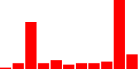
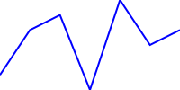

# svg-sparklines
Experiment creating sparklines using SVG

## Usage

```bash
git clone https://github.com/welliot/svg-sparklines.git
cd svg-sparklines
npm up
npm run
```

Key thing for sign is "alignment-baseline" and "text-anchor"

```xml
<text x="100" y="25" fill="red" text-anchor="middle" alignment-baseline="central">Some Text Here</text>
```


### Spark-bar

http://localhost:8080/api/sparkbar?y=-1,2,30,2,4,1,2,2,3,45,8&color=red

Output:



### Spark-line

http://localhost:8080/api/sparkline?x=1,2,3,4,5,6,7&y=-1,2,3,-2,4,1,2&color=blue

Output:




### Circle (Speed limit sign)

http://localhost:8080/api/circle?label=10&color=blue

Output:


